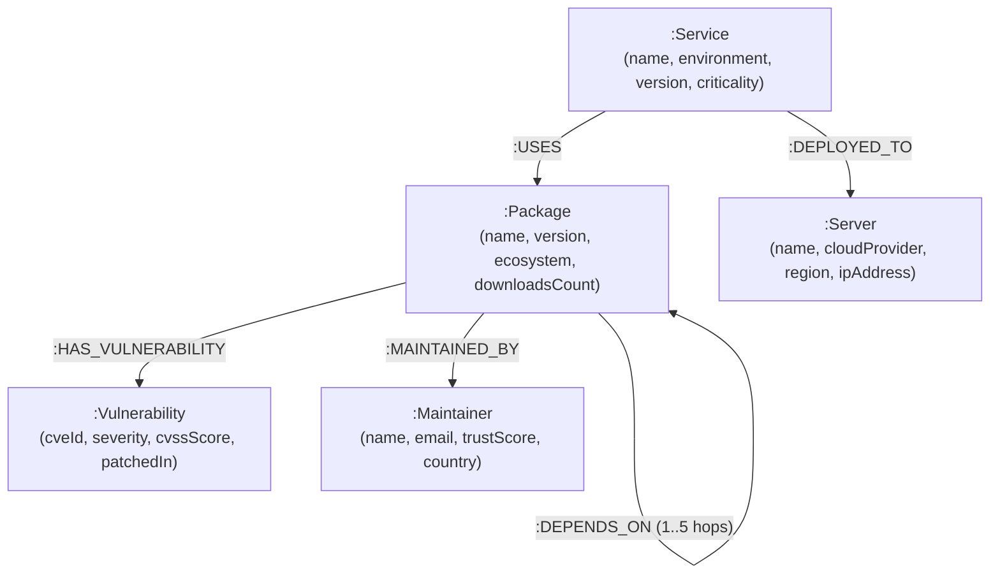

# NexusGraph — Cloud Supply Chain & Vulnerability Blast Radius Engine
### Wexa AI Take-Home Assignment · Graph Database Application (CognoDB)

NexusGraph is a modern graph database web application backed by **CognoDB** (managed graph database using openCypher over the Bolt 5.x protocol). It models software supply chains, microservices, open-source package dependencies, maintainers, CVE vulnerabilities, and cloud infrastructure servers to calculate real-time vulnerability blast radiuses, shortest attack paths, and high-risk maintainer centralities.

---

## 📌 1. "Why a Graph Database?" (Graph vs. Relational Schema)

In modern software development, a microservice rarely depends only on direct libraries. It imports packages that import other packages 3 to 6 levels deep. 

### The Relational SQL Problem
In a relational database (PostgreSQL / MySQL):
* Modeling variable-depth transitive package dependencies requires **complex, expensive recursive Common Table Expressions** (`WITH RECURSIVE`).
* Finding which production server is affected by a deep open-source vulnerability requires joining 5+ tables (`servers`, `deployments`, `services`, `dependencies`, `packages`, `vulnerabilities`).
* As the dependency tree grows to millions of edges, recursive SQL queries suffer exponential performance degradation due to repeated table scans and hash joins.

### The CognoDB Graph Solution
In **CognoDB (openCypher)**:
* **Paths are first-class primitives**: The pattern `(s:Service)-[:USES|DEPENDS_ON*1..5]->(p:Package)-[:HAS_VULNERABILITY]->(v:Vulnerability)` traverses 5 dependency levels in sub-milliseconds without table join overhead.
* **Graph Algorithms**: Built-in path functions like `shortestPath(...)` calculate the exact attack vector from an exposed cloud server down to a compromised library instantly.
* **Intuitive Schema**: Graph nodes (`Service`, `Package`, `Vulnerability`, `Maintainer`, `Server`) and typed relationships mapping directly to real-world software architecture.

---

## 📐 2. Graph Data Model



### Node Labels & Properties
* **`:Service`**: `id`, `name`, `environment` (`production`, `staging`), `ownerTeam`, `version`, `criticality`
* **`:Package`**: `id`, `name`, `version`, `ecosystem` (`npm`, `pypi`), `downloadsCount`
* **`:Vulnerability`**: `id`, `cveId`, `severity` (`CRITICAL`, `HIGH`, `MEDIUM`), `cvssScore`, `description`, `patchedIn`
* **`:Maintainer`**: `id`, `name`, `email`, `trustScore`, `country`
* **`:Server`**: `id`, `name`, `cloudProvider` (`AWS`, `GCP`), `region`, `ipAddress`

---

## ⚙️ 3. CognoDB Cloud Setup Instructions

1. **Sign Up**: Go to [https://console.cognodb.com/signup](https://console.cognodb.com/signup) and create a free account (no credit card required).
2. **Provision Instance**: Create a free **c0** instance. Provisioning completes in under 60 seconds.
3. **Copy Credentials**: Save your Connection URI (`bolt+s://<instance-id>.databases.cognodb.cloud`) and password for user `cognodb`.
4. **Set Environment Variables**: Create a `.env` file in the root of this repository:

```env
COGNODB_URI=bolt+s://<your-instance-id>.databases.cognodb.cloud
COGNODB_USER=cognodb
COGNODB_PASSWORD=<your-generated-cognodb-password>
```

> **Note on Graceful Fallback**: If `.env` credentials are not set or CognoDB is unreachable, NexusGraph automatically operates in **Offline Demo Mode** with realistic mock data, ensuring zero application crashes.

---

## 🔍 4. Key Cypher Queries Explained

All queries are fully **parameterized** via the official `neo4j-driver` JavaScript driver to prevent Cypher injection and maximize database query plan caching.

### Query 1: Multi-Hop Transitive Blast Radius (2 to 5 Hops)
Finds all production microservices and cloud servers affected by deep transitive package vulnerabilities:
```cypher
MATCH path = (s:Service)-[:USES|DEPENDS_ON*1..5]->(p:Package)-[:HAS_VULNERABILITY]->(v:Vulnerability)
WHERE ($severity = 'ALL' OR v.severity = $severity)
OPTIONAL MATCH (s)-[:DEPLOYED_TO]->(srv:Server)
RETURN 
  s.name AS serviceName, 
  s.environment AS environment, 
  p.name AS vulnerablePackage, 
  v.cveId AS cveId, 
  v.severity AS severity, 
  srv.name AS serverName, 
  length(path) AS hopDepth
ORDER BY hopDepth ASC
```

### Query 2: Shortest Attack Vector Calculation
Uses openCypher `shortestPath(...)` to trace the exact shortest dependency hop from an exposed cloud server to a CVE:
```cypher
MATCH (srv:Server {name: $serverName}), (v:Vulnerability {cveId: $cveId})
MATCH p = shortestPath((srv)<-[:DEPLOYED_TO]-(:Service)-[:USES|DEPENDS_ON*1..6]->(:Package)-[:HAS_VULNERABILITY]->(v))
RETURN [n IN nodes(p) | labels(n)[0] + ': ' + coalesce(n.name, n.cveId)] AS attackPath, length(p) AS hopLength
```

### Query 3: High Centrality Maintainer Blast Score
Calculates which open-source maintainers control packages with the highest downstream blast radius on production services:
```cypher
MATCH (m:Maintainer)<-[:MAINTAINED_BY]-(p:Package)<-[:USES|DEPENDS_ON*1..5]-(s:Service)
RETURN m.name AS maintainer, m.email AS email, m.trustScore AS trustScore, count(DISTINCT s) AS impactedServices, count(DISTINCT p) AS managedPackages
ORDER BY impactedServices DESC
LIMIT 10
```

---

## 🚀 5. Data Seeding & Running Locally

### Prerequisites
* Node.js v18+ 
* npm v9+

### Installation & Data Seeding
```bash
# Clone the repository
git clone https://github.com/your-username/nexus-graph-cognodb.git
cd nexus-graph-cognodb

# Install dependencies
npm install

# Seed CognoDB Database with fresh nodes & multi-hop relationships
npm run seed

# Run local development server
npm run dev
```

Open [http://localhost:3000](http://localhost:3000) in your browser.

---

## 🌐 6. Deliverables & Demo Links

* **Hosted Web Application Demo**: `https://nexus-graph-cognodb.vercel.app` *(or Vercel / Render deployment)*
* **Screen Recording Walkthrough**: `https://youtube.com/watch?v=demo-id`
* **GitHub Repository**: `https://github.com/your-username/nexus-graph-cognodb`

---

## 🛡️ Engineering & Architecture Highlights
* **Official Neo4j JS Driver**: Direct `bolt+s://` protocol integration with parameter binding.
* **Interactive Visualization**: Canvas network visualization powered by `vis-network` with custom color nodes, zoom, drag-and-drop, search filters, and physics layout toggles.
* **Resilient Architecture**: Built-in health check route (`/api/health`) and fallback engine.
